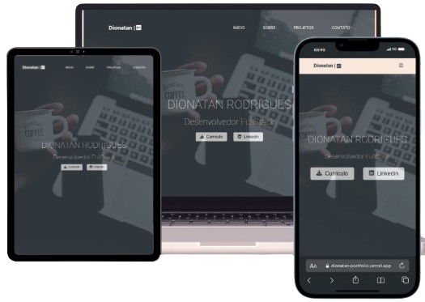

# Dionatan Rodrigues | Portfolio

### Imagem do Projeto

   

### Sobre

    Este repositório contém o código-fonte do meu site pessoal de portfólio. É uma vitrine digital onde apresento minhas habilidades e projetos como desenvolvedor web. O site demonstra minha abordagem ao desenvolvimento web, focando em design responsivo.

### Tecnologias Utilizadas

    O site foi construído utilizando uma variedade de tecnologias e ferramentas modernas:

- **HTML & CSS**: Estruturação e estilização responsiva do site.
- **JavaScript**: Utilizado para criar interatividade e funcionalidades dinâmicas.
- **FontAwesome**: Ícones estilizados e de fácil implementação.
- **Git**: Utilizado no versionamento de todo projeto.

### Links

    <strong>Site : </strong>
    <a href="https://dionatan-portfolio.vercel.app/" target="_blank" rel="external">Dionatan | DEV</a>

   <strong>Linkedin : </strong>
   <a href="https://www.linkedin.com/in/dionatan-rodrigues-76b507255/" target="_blank" rel="external">Dionatan Rodrigues</a>
 

Obrigado por visitar meu portfólio!

